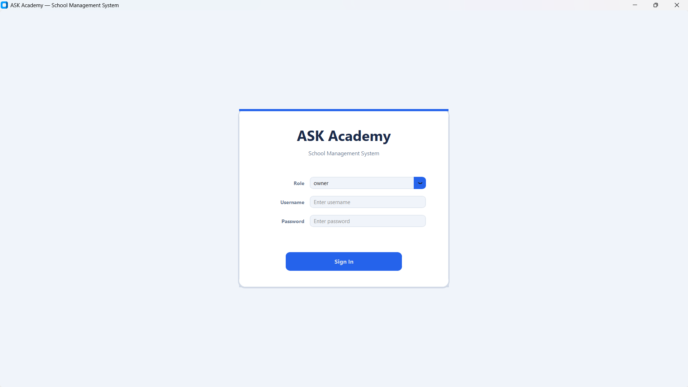
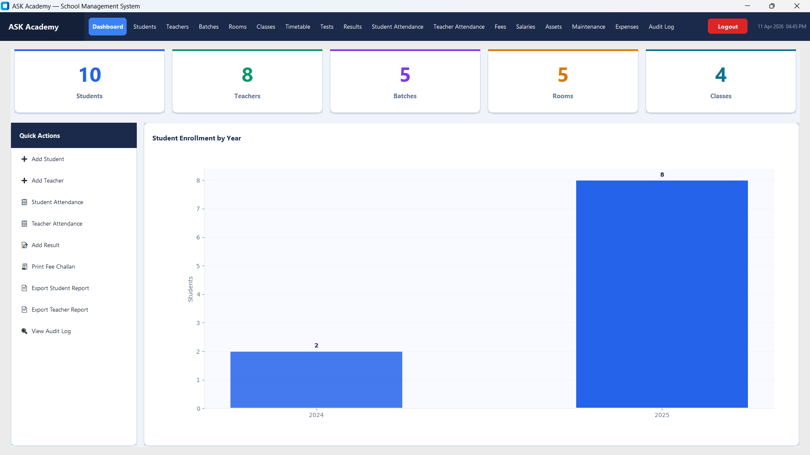

# 🎓 ASK Academy — School Management System

A desktop-based school management system built with Python. Features a modern dark-navy UI, full CRUD operations for students, teachers, classes, and results — all backed by an **Azure SQL** database. Includes analytics dashboards with charts and PDF report generation.

---

## 📸 Screenshots

### Login


### Dashboard


### Data Page with Filters


### Add New Data


---

## 🛠 Tech Stack

| Component       | Technology                                      |
|-----------------|-------------------------------------------------|
| UI Framework    | Python CustomTkinter (modern tkinter)           |
| Database        | Azure SQL Server via `pyodbc`                   |
| Charts          | Matplotlib (embedded in tkinter via FigureCanvasTkAgg) |
| PDF Reports     | ReportLab                                       |
| Date Picker     | tkcalendar                                      |
| Language        | Python 3                                        |

---

## 🧠 Core Concepts

### Architecture — Single-File App
The entire application (`ASK_Academy.py`) is a single-file Python desktop app. All screens, database calls, widgets, and logic are modularised within the file using class-based design.

### Azure SQL Integration
- Uses `pyodbc` to connect to a hosted **Azure SQL Server** database.
- All queries are parameterised to prevent SQL injection.
- The `schema.sql` file contains the full database schema for fresh deployments.
- `testdata.py` populates the DB with test records for development.

### Multi-Filter System
Every data screen (Students, Teachers, Classes, Results) has a multi-column filter system — users can combine filters across multiple fields simultaneously before hitting Search.

### Embedded Charts (Matplotlib in tkinter)
The dashboard uses `FigureCanvasTkAgg` to render live Matplotlib charts directly inside the tkinter window — no separate chart windows open.

### PDF Generation (ReportLab)
Users can export any data view or report as a formatted **A4 PDF** using ReportLab's `SimpleDocTemplate` with tables, styles, and spacing.

### UI Colour Theme
```python
DARK_NAVY  = "#1B2A4A"   # Primary background
MID_BLUE   = "#2563EB"   # Buttons / accents
ACCENT     = "#3B82F6"   # Highlights
LIGHT_BG   = "#F0F4FA"   # Card background
SUCCESS    = "#10B981"   # Success states
```

---

## 📁 File Hierarchy

```
ask_academy/
│
├── ASK_Academy.py       # Main application (all UI + logic)
├── schema.sql           # Azure SQL schema — tables: students, teachers, classes, results
├── testdata.py          # Seed script for populating test data
├── requirements.txt     # Python dependencies
│
└── screenshots/
    ├── login.png
    ├── dashboard.png
    ├── data page with filters.png
    └── add new data.png
```

---

## 📦 Database Schema (Azure SQL)

Key tables defined in `schema.sql`:
- **Students** — student info, enrollment, class assignment
- **Teachers** — teacher details, subjects
- **Classes** — class name, teacher, schedule
- **Results** — student grades per subject per term

---

## ⚙️ Setup & Run

```bash
pip install -r requirements.txt
# Update the Azure SQL connection string inside ASK_Academy.py
# Optionally run schema.sql against your Azure SQL instance
# Optionally run testdata.py to seed sample data
python ASK_Academy.py
```

### Requirements
```
customtkinter>=5.2.0
pyodbc>=5.0.0
matplotlib>=3.8.0
tkcalendar>=1.6.1
reportlab>=4.1.0
```

> **Note:** You need an Azure SQL Server instance and valid connection credentials configured inside the app.
